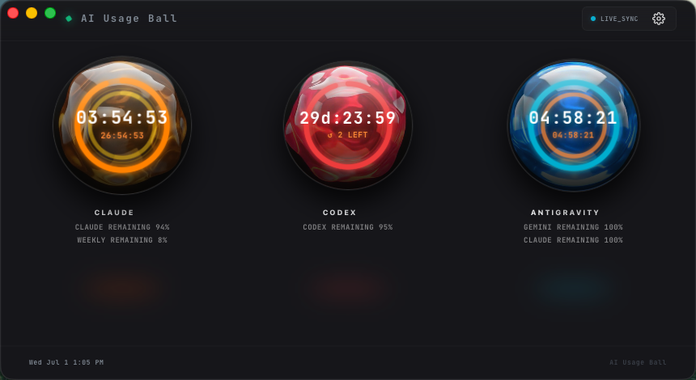

# AI Usage Ball

A source-available macOS desktop app that shows how much of your AI coding-tool
quota — Claude, Codex / ChatGPT, and Antigravity — you have left, as animated
liquid gauges. Session limits, weekly limits, and reset countdowns, at a
glance.



**Try the signed, notarized build:** [Download for Apple Silicon](https://github.com/aiusageball/ai-usage-ball/releases/latest/download/AI-Usage-Ball.dmg)
or [see the website](https://aiusageball.com) for details. The trial lasts 30
days with no card required; after that it is a one-time A$9.99 purchase with no
subscription.

This repository is the full source, published so anyone can audit exactly what
the app reads from your machine and how. It is source-available for
auditability and noncommercial self-builds — see [License](#license) for what
you can and can't do with it.

## What's in here

| Path | What it is |
|---|---|
| `dashboard/` | The desktop app — Tauri v2 (Rust) + React frontend. Main window, desktop widgets, the liquid-orb visualization. |
| `server/` | Python (FastAPI) backend the app talks to on `127.0.0.1:8000`. Reads local usage data (Claude via browser session cookie / CLI credentials, Codex via `~/.codex/auth.json`, Antigravity via local process detection) and streams it to the frontend over SSE. |
| `AiPulseWatch/` | watchOS companion (SwiftUI), work in progress. |
| `landing/` | Source for the [aiusageball.com](https://aiusageball.com) marketing site (static HTML, no build step). |

## Why developers use it

- Keep AI coding-tool limits visible before a session unexpectedly runs out.
- See reset countdowns and weekly/session windows without opening each provider.
- Audit the local readers that collect usage state from your own Mac.
- Run the desktop UI as a Tauri app backed by a local FastAPI service.

## How it reads your usage

Everything is read **locally**, from sessions/credentials already on your
machine — nothing is proxied through a server we run. The backend's polling
logic lives in `server/server.py`; that file is the ground truth for exactly
what's read and from where.

## Running it locally

**Backend:**
```bash
cd server
python3 -m venv venv && source venv/bin/activate
pip install -r requirements.txt
python server.py   # serves http://127.0.0.1:8000
```

**Desktop app:**
```bash
cd dashboard
npm install
npm run tauri:dev
```

**Building a distributable `.app`/`.dmg`:** the release build bundles the
backend into the app as a self-contained sidecar (so end users don't need
Python). Build it first, then run the Tauri build:

```bash
# 1. Freeze the backend into a single binary (PyInstaller)
cd server && source venv/bin/activate && pip install pyinstaller
pyinstaller --onefile --name aipulse-server \
  --collect-all uvicorn --collect-all fastapi --collect-all zeroconf \
  --collect-all browser_cookie3 --collect-all anyio \
  --add-data "../dashboard/public/liquid-loop.mp4:." server.py

# 2. Place it where Tauri expects the sidecar (name includes the target triple)
cp dist/aipulse-server \
  ../dashboard/src-tauri/binaries/aipulse-server-aarch64-apple-darwin

# 3. Build the app
cd ../dashboard && npm run tauri:build
```

Signing/notarizing requires your own Apple Developer identity (see
`dashboard/src-tauri/tauri.conf.json` → `bundle.macOS.signingIdentity`;
`entitlements.plist` carries `disable-library-validation`, which the
PyInstaller sidecar needs to load its embedded Python under a hardened
runtime). Unsigned local builds work fine for development.

## License

Licensed under the [PolyForm Noncommercial License 1.0.0](LICENSE): you're
free to read, audit, modify, and build the source for personal / noncommercial
use. Commercial use (selling it, bundling it, offering it as a paid service,
etc.) isn't permitted under this license — get in touch if you want that.

The official signed, notarized build at [aiusageball.com](https://aiusageball.com)
supports continued development.
